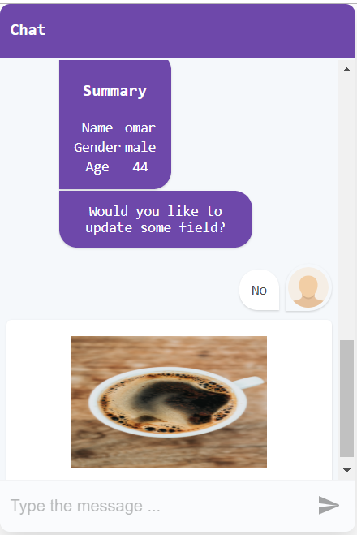

## GIT --- Guide du développeur

J'utilise Le composant react [react-simple-chatbot](https://lucasbassetti.com.br/react-simple-chatbot/#/docs/installation) pour développer cette application. 

Pour personnaliser la partie graphique de composant react-simple-chabot visitie ce [lien](https://lucasbassetti.com.br/react-simple-chatbot/#/docs/chatbot). 

Pour planifier les étapes que va être suivies par le robot, visite ce [lien](https://lucasbassetti.com.br/react-simple-chatbot/#/docs/steps).

## installation des packages

### `npm install`

## Lance l'application

### `npm start`

Lance l'application en mode développement. 
Ouvre [http://localhost:3000](http://localhost:3000) pour voir l'application dans le navigateur. 

Voici l'interface graphique.

