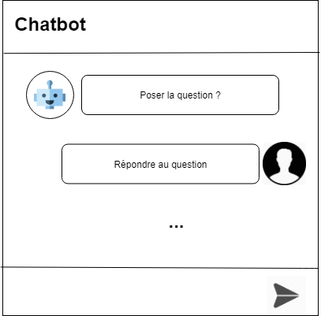

## Application chatbot
### Conception

Cette partie présente l'architecture de l'application chatbot. 

### Description

L'utilisateur accède à la page Chatbot, le robot va suivre ces étapes pour récuperer les informations de l'utilisateur 
1)Le Robot va poser les trois questions suivantes  
*)What is your name ? 
*)What is your gender ? 
*)How old are you ? 
2) Puis le robot va afficher les informations de l'utilisateur 

3)Puis le robot va demander à l'utilisateur de modifier ces informations, s'il veut 

  *) s'il l'utilisateur répond par "oui", il doit choisir le champs qu'il veut changer, après la modification le robot retourne à l'étape 2 

  *)sinon le robot va afiicher une image 
  

    